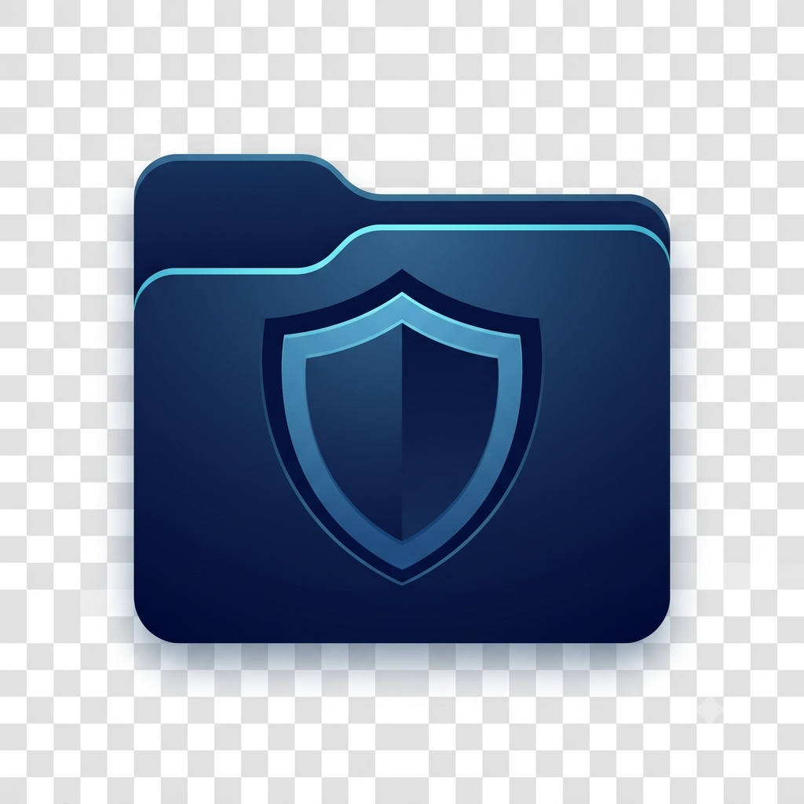
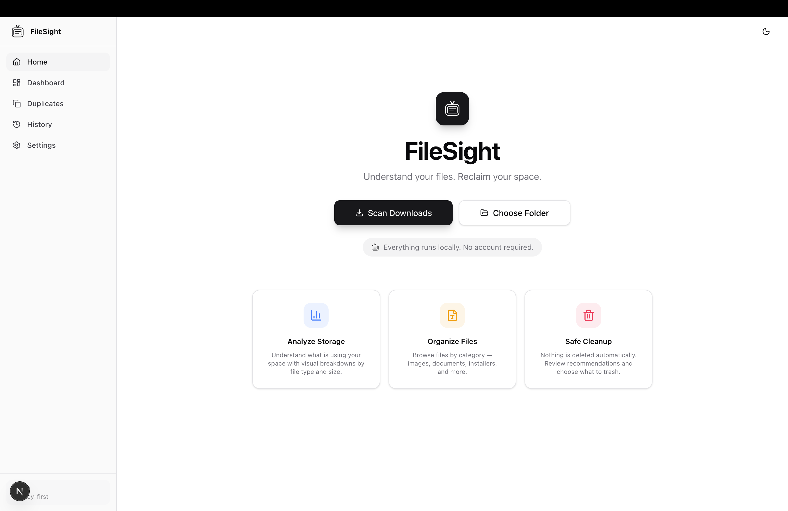
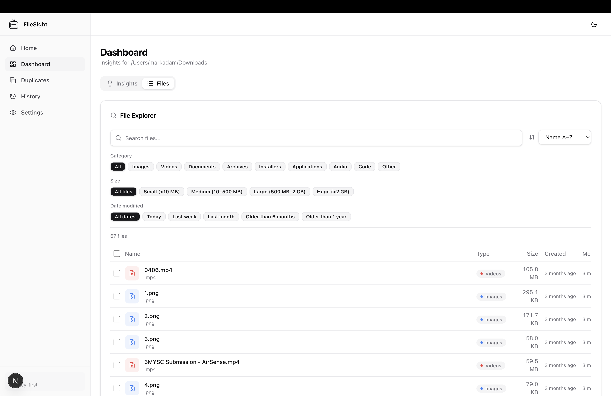
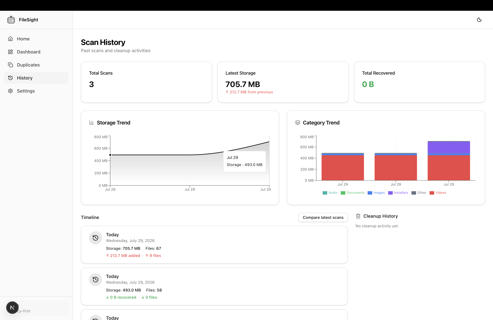

<div align="center">
  <br />
  <picture>
    <source media="(prefers-color-scheme: dark)" srcset="./assets/logo/filesight.png">
    
  </picture>
  <h1 align="center">FileSight</h1>
  <p align="center">
    <strong>Understand your files. Reclaim your space.</strong>
  </p>
  <p align="center">
    A privacy-first desktop application for understanding, organizing, and cleaning your files.
    <br />
    Entirely local. Zero cloud dependencies. No telemetry.
  </p>
  <p align="center">
    <a href="#features">Features</a>&nbsp;·&nbsp;
    <a href="#screenshots">Screenshots</a>&nbsp;·&nbsp;
    <a href="#installation">Installation</a>&nbsp;·&nbsp;
    <a href="#architecture">Architecture</a>&nbsp;·&nbsp;
    <a href="docs/INSTALLATION.md">Documentation</a>&nbsp;·&nbsp;
    <a href="CONTRIBUTING.md">Contributing</a>
  </p>
  <p align="center">
    
    
    
    
  </p>
  <br />
</div>

---

## The Problem

Over time, your Downloads folder becomes a digital attic. Old installers, duplicate files with different names, scattered documents, and large forgotten files accumulate silently. Disk space shrinks. Finding what matters becomes harder.

Existing solutions either upload your files to the cloud (compromising privacy), charge subscription fees, or lack the depth to detect similar (not just identical) duplicates and intelligently organize files by type.

**FileSight was built to solve this — entirely on your machine.**

---

## The Solution

FileSight gives you a complete picture of your files, detects duplicates at three levels of precision, suggests organization strategies, and lets you act with confidence — all without your data ever leaving your device.

- **Scan** any folder and get a complete file inventory with metadata
- **Analyze** storage by category, size, and age
- **Detect** duplicates — exact copies, similar images, similar documents, and filename matches
- **Organize** files into structured folders by type, with full undo support
- **Preview** images, PDFs, videos, and text files before acting
- **Clean** safely — files move to the system Trash, never permanently deleted without confirmation

---

## Features

### File Scanner

Recursively scan directories and extract rich metadata from every file: name, size, extension, creation and modification dates, and content category. Configurable scan depth, hidden file handling, and symbolic link options. Real-time progress reporting with estimated completion.

### Storage Insights

Visual breakdown of storage by file category (images, videos, documents, archives, installers, audio, code, applications, and other). Identify largest files, oldest files, and get actionable suggestions — old installers taking up space, stale archives, and large files worth reviewing.

### Download Organization Assistant

Automatically classify files by type and generate a plan to organize them into folder categories. Preview every proposed move before executing. Destinations are created automatically, duplicate filenames are handled via intelligent renaming, and every move can be undone.

- **7 categories:** Images, Documents, Videos, Audio, Archives, Installers, Other
- **Safe execution:** Preview before moving, conflict resolution (rename / skip)
- **Full undo:** Every move is recorded and reversible from the History page

### Duplicate Finder 2.0

Three levels of duplicate detection with smart recommendations:

**Level 1 — Exact duplicates:** Files are grouped by size first, then SHA-256 hashed. Only files with matching sizes are hashed, avoiding unnecessary computation. Identical hashes form duplicate groups.

**Level 2 — Similar files:**

- **Images:** Perceptual difference hashing (dHash) via Sharp. Compares visual fingerprints to find resized, recompressed, or slightly modified images. Returns a similarity percentage.
- **Documents:** Text extraction from PDF, DOCX, TXT, and Markdown files. TF-IDF vectorization with cosine similarity to find documents with substantially similar content.
- **Videos:** Metadata-based comparison using file size, extension, modification date, and filename similarity.

**Level 3 — Filename intelligence:** Detects files that are likely duplicates based on naming patterns — copy suffixes, numbered versions (photo (1).jpg), "final" and "backup" markers, and conflicting copy patterns. Uses Levenshtein distance for fuzzy matching.

**Smart recommendation:** For each group, FileSight recommends which file to keep based on resolution (higher is better), modification date (newer is better), file size (larger is better for originals), and filename quality.

### File Preview

Preview supported file types directly in the application — no external viewers needed:

| Type   | Formats                                                   |
| ------ | --------------------------------------------------------- |
| Images | PNG, JPG, JPEG, GIF, WebP, SVG, BMP, ICO                  |
| Text   | TXT, MD, JSON, JS, TS, JSX, TSX, HTML, CSS, XML, CSV, LOG |
| PDF    | PDF                                                       |
| Audio  | MP3, WAV, OGG, M4A                                        |
| Video  | MP4, MOV, WebM, AVI, MKV                                  |

### History & Tracking

Every scan, cleanup, and organization action is recorded:

- **Scan history:** Full scan results with category breakdowns, largest files, and duplicate size. Compare any two scans to see storage changes over time.
- **Cleanup tracking:** Every file moved to Trash is recorded with total space recovered.
- **Organization history:** Every file organization batch is stored with full undo capability.
- **Timeline view:** Visual timeline of all scan activity with storage and category trend charts.

### Safe Cleanup

Files are never deleted without confirmation. The cleanup workflow is:

1. **Preview** — See which files will be affected and how much space will be recovered
2. **Confirm** — Explicitly approve the action
3. **Move to Trash** — Files are sent to the system Trash/Recycle Bin using `shell.trashItem()`
4. **Track** — All cleanups are recorded in history with space recovered totals

---

## Screenshots

|                  Home                  |                    Dashboard                     |                   History                    |
| :------------------------------------: | :----------------------------------------------: | :------------------------------------------: |
|  |  |  |

---

## How It Works

```
Select a folder
      │
      ▼
┌─────────────────┐
│  File Scanner    │  Recursive directory walk, metadata extraction, categorization
│  (electron/scanner)
└────────┬────────┘
         │
         ▼
┌─────────────────────┐
│  Analysis Engine    │  Storage stats, category breakdown, largest/oldest files
│  (electron/analyzer)│  Suggestions for cleanup opportunities
└────────┬────────────┘
         │
         ▼
┌─────────────────────────┐
│  Duplicate Finder       │  Level 1: SHA-256 exact match
│  (electron/services/    │  Level 2: Perceptual image, document text, video metadata
│   duplicateFinder/)     │  Level 3: Filename intelligence + Levenshtein distance
└────────┬────────────────┘
         │
         ▼
┌─────────────────────────┐
│  Organization Engine    │  Classify files → generate plan → preview moves
│  (electron/services/)   │  Execute with conflict resolution → undo support
└────────┬────────────────┘
         │
         ▼
┌─────────────────┐
│  User Review     │  Preview, select, confirm, or reject each action
└────────┬────────┘
         │
         ▼
┌──────────────────┐
│  Safe Cleanup     │  Move to OS Trash (not permanent deletion)
│  or Organization  │  Record in history, enable undo
└──────────────────┘
```

---

## Architecture

FileSight is an **Electron + Next.js** application. The frontend is a static Next.js export served via a custom `app://` protocol handler in the Electron main process. The renderer operates in a sandboxed context with `contextIsolation: true` and no `nodeIntegration`.

```
┌─────────────────────────────────────────────────────┐
│                    Electron                         │
│  ┌─────────────────────────────────────────────┐    │
│  │           Main Process                       │    │
│  │  ┌──────────┐  ┌──────────────────────┐     │    │
│  │  │ Scanner  │  │  Analyzer            │     │    │
│  │  │ Cleanup  │  │  Duplicate Finder    │     │    │
│  │  │ Settings │  │  Organization Engine │     │    │
│  │  └────┬─────┘  └──────────┬───────────┘     │    │
│  │       │                   │                  │    │
│  │  ┌────▼───────────────────▼───────────┐     │    │
│  │  │        IPC Handlers                │     │    │
│  │  │  (electron/ipc/)                   │     │    │
│  │  └────────────────┬───────────────────┘     │    │
│  └───────────────────┼─────────────────────────┘    │
│                      │                              │
│  ┌───────────────────▼─────────────────────────┐    │
│  │           Renderer Process (sandboxed)       │    │
│  │                                              │    │
│  │  ┌──────────────────────────────────────┐   │    │
│  │  │  Next.js 16 (static export)         │   │    │
│  │  │  React 19 · TypeScript · Tailwind 4 │   │    │
│  │  │  Zustand 5 · Recharts · Radix UI    │   │    │
│  │  └──────────────────────────────────────┘   │    │
│  │         ▲                                    │    │
│  │         │ contextBridge (preload.ts)         │    │
│  └──────────────────────────────────────────────┘    │
└─────────────────────────────────────────────────────┘
```

### Frontend (Next.js)

- **Routing:** Next.js App Router with static generation (`output: 'export'`)
- **State:** Zustand stores for scan results, duplicate detection, and history
- **UI:** Radix UI primitives (dialog, tabs, collapsible, checkbox, scroll-area) with Tailwind CSS 4 styling and Lucide icons
- **Charts:** Recharts for storage trend and category trend visualizations
- **Theming:** next-themes for light/dark/system mode support

### Desktop Layer (Electron)

- **Main process:** Window management, custom `app://` protocol for serving static files, all file I/O and system operations
- **Preload:** Context bridge (`contextBridge.exposeInMainWorld('electronAPI', ...)`) exposing typed IPC methods
- **Sandbox:** Renderer runs with `sandbox: true`, no direct Node.js access

### Services (Electron main process)

All business logic runs in the main process:

| Module                                    | Responsibility                                                         |
| ----------------------------------------- | ---------------------------------------------------------------------- |
| `electron/scanner/`                       | Recursive directory traversal, metadata extraction, progress reporting |
| `electron/analyzer/`                      | Storage analysis, category breakdown, suggestion generation            |
| `electron/services/duplicateFinder/`      | Three-level duplicate detection engine                                 |
| `electron/services/fileClassifier.ts`     | Extension-to-category mapping                                          |
| `electron/services/organizationEngine.ts` | Organization plan generation                                           |
| `electron/services/moveManager.ts`        | Safe file moves with conflict resolution                               |
| `electron/services/undoManager.ts`        | Move reversal and undo record persistence                              |
| `electron/duplicate-engine/`              | Legacy duplicate detection (simpler hashing + filename matching)       |
| `electron/cleanup/`                       | Trash integration via `shell.trashItem()`                              |
| `electron/settings/`                      | User preferences persistence                                           |

### Storage

- **Database:** JSON file at `{userData}/database.json` with in-memory caching
- **Settings:** Separate JSON file at `{userData}/settings.json`
- **Schema:** `{ scans: ScanRecord[], cleanups: CleanupRecord[], organizations: OrgUndoRecord[] }`
- **No external databases, no cloud storage, no server-side persistence.**

### Project Structure

```
filesight/
├── src/                          # Next.js frontend
│   ├── app/                      # Pages (home, dashboard, duplicates, history, settings)
│   │   ├── page.tsx              # Home / scan entry point
│   │   ├── dashboard/page.tsx    # Insights, Organize, Files tabs
│   │   ├── duplicates/page.tsx   # Duplicate review
│   │   ├── history/page.tsx      # Scan history + trends + comparisons
│   │   └── settings/page.tsx     # User preferences
│   ├── components/               # 93 React components
│   │   ├── ui/                   # Primitive UI components (Radix + custom)
│   │   ├── duplicates/           # Duplicate detection UI
│   │   ├── organization/         # Organization assistant UI
│   │   ├── preview/              # File preview components
│   │   ├── history/              # History and timeline components
│   │   ├── insights/             # Analysis dashboard components
│   │   └── ...
│   ├── hooks/                    # 10 custom hooks
│   ├── stores/                   # Zustand state stores
│   ├── lib/                      # Utilities, constants, file helpers
│   └── types/                    # Shared TypeScript types
│
├── electron/                     # Electron main process
│   ├── main.ts                   # App entry, protocol registration, window setup
│   ├── preload.ts                # Context bridge (50+ IPC methods)
│   ├── scanner/                  # File scanning engine
│   ├── analyzer/                 # Storage analysis engine
│   ├── services/                 # Business logic services
│   │   ├── duplicateFinder/      # Duplicate detection engine (3 levels)
│   │   ├── fileClassifier.ts     # File category classification
│   │   ├── organizationEngine.ts # File organization planning
│   │   ├── moveManager.ts        # File move execution
│   │   └── undoManager.ts        # Organization undo system
│   ├── cleanup/                  # Trash integration
│   ├── database/                 # JSON persistence layer
│   ├── settings/                 # User settings management
│   └── ipc/                      # 9 IPC handler modules
│
├── tests/                        # 279 tests across 19 test files
├── assets/                       # Branding, icons, screenshots
├── resources/                    # App icons and build resources
├── docs/                         # Documentation
├── scripts/                      # Dev tooling
└── .github/                      # CI/CD workflows
```

---

## Privacy & Security

FileSight is designed with a **local-first, privacy-by-design** architecture. This is not a marketing claim — it is enforced by the architecture itself.

- **Files never leave your computer.** All scanning, analysis, hashing, and processing happens in the Electron main process on your local machine.
- **No outbound network requests.** The application has zero cloud dependencies. No telemetry, no analytics, no crash reporting, no tracking.
- **No account required.** There is no registration, login, or user account system.
- **User controls every action.** Nothing is deleted automatically. All cleanups go through a preview → confirm → trash workflow. Moves to the system Trash are reversible.
- **Minimal permissions.** The application only reads directories you explicitly select through the native folder picker. No network, camera, microphone, or location permissions are requested.

For full details, see [docs/PRIVACY.md](docs/PRIVACY.md) and [SECURITY.md](SECURITY.md).

---

## Installation

### Pre-built Binaries

Download the latest release for your platform from the [Releases page](https://github.com/MarkCoder1/filesight/releases/tag/v1.0.0).

| Platform | Format      | Command                              |
| -------- | ----------- | ------------------------------------ |
| macOS    | `.dmg`      | Open DMG, drag to Applications       |
| Windows  | `.exe`      | Run installer                        |
| Linux    | `.AppImage` | `chmod +x && ./FileSight-*.AppImage` |
| Linux    | `.deb`      | `sudo dpkg -i FileSight-*.deb`       |

### Build from Source

**Requirements:** Node.js 18+ and npm 9+.

```bash
git clone https://github.com/anomalyco/filesight.git
cd filesight
npm install

# Development mode (Next.js + Electron concurrently)
npm run dev

# Production build + package
npm run dist:mac   # macOS DMG
npm run dist:win   # Windows NSIS installer
```

See [docs/INSTALLATION.md](docs/INSTALLATION.md) for detailed setup instructions, development commands, and troubleshooting.

---

## Building

| Command                  | Output                                 |
| ------------------------ | -------------------------------------- |
| `npm run dist:mac`       | `dist/FileSight-*-mac.dmg`             |
| `npm run dist:win`       | `dist/FileSight-*-win.exe`             |
| `npm run dist`           | Current platform package               |
| `npm run build:next`     | `out/` (static HTML export)            |
| `npm run build:electron` | `electron-dist/` (compiled TypeScript) |
| `npm test`               | Test results (279 tests)               |

The build pipeline: Next.js static export → Electron TypeScript compilation → electron-builder packaging. See [electron-builder.yml](./electron-builder.yml) for full configuration.

---

## Roadmap

- [x] File scanning with progress reporting
- [x] Storage insights and analysis
- [x] Smart cleanup suggestions
- [x] File explorer with search, filter, sort
- [x] Duplicate detection (exact, perceptual, document text, filename)
- [x] Download organization assistant with undo
- [x] File preview (images, PDFs, text, audio, video)
- [x] Scan history with trend charts and comparisons
- [x] Settings and preferences
- [x] Onboarding wizard
- [ ] Advanced similarity algorithms (video frame comparison, audio fingerprinting)
- [ ] Batch organization of multiple folders
- [ ] Custom organization rules
- [ ] Export reports (PDF, CSV)

---

## Technology Stack

| Layer                | Technology                                                            |
| -------------------- | --------------------------------------------------------------------- |
| **Framework**        | Next.js 16 (static export)                                            |
| **UI Library**       | React 19                                                              |
| **Desktop**          | Electron 43                                                           |
| **Language**         | TypeScript 5                                                          |
| **Styling**          | Tailwind CSS 4                                                        |
| **State**            | Zustand 5                                                             |
| **Charts**           | Recharts 3                                                            |
| **Icons**            | Lucide React 1                                                        |
| **UI Primitives**    | Radix UI (dialog, tabs, collapsible, checkbox, scroll-area, progress) |
| **Hashing**          | Node.js crypto (SHA-256)                                              |
| **Image Analysis**   | Sharp (perceptual dHash)                                              |
| **Document Parsing** | pdf-parse (PDF), mammoth (DOCX)                                       |
| **Testing**          | Vitest (279 tests across 19 test suites)                              |
| **Building**         | electron-builder 26                                                   |
| **Package Manager**  | npm                                                                   |

---

## Contributing

Contributions are welcome and appreciated. See [CONTRIBUTING.md](CONTRIBUTING.md) for detailed guidelines on:

- Setting up the development environment
- Code style and conventions
- Testing requirements
- Pull request process

**Key points:**

- TypeScript with strict mode
- Tests required for new functionality
- Run `npm test` and `npm run build` before submitting
- Keep PRs focused on a single concern

---

## License

[MIT](./LICENSE) — Copyright (c) 2026 FileSight

FileSight is open-source software. See [LICENSE](./LICENSE) for the full license text.

---

<p align="center">
  Built with Electron, Next.js, and TypeScript. Runs entirely on your device.
  <br />
  <a href="https://github.com/anomalyco/filesight/issues">Report a bug</a>&nbsp;·&nbsp;
  <a href="https://github.com/anomalyco/filesight/discussions">Start a discussion</a>&nbsp;·&nbsp;
  <a href="CHANGELOG.md">Changelog</a>
</p>
